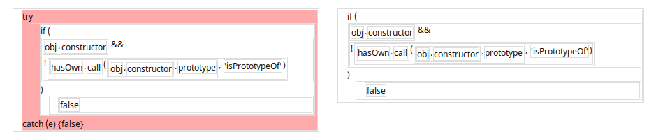
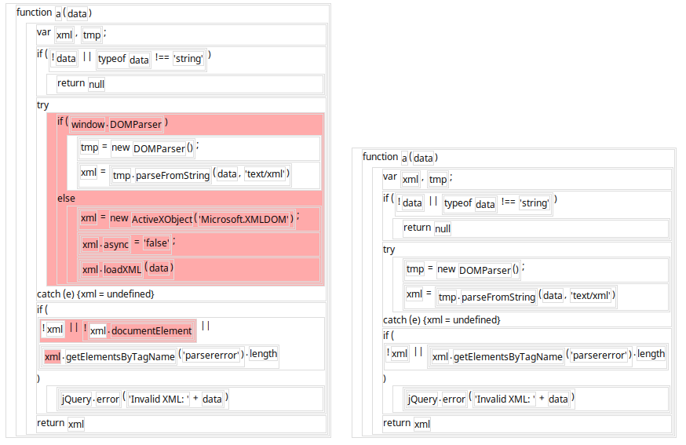

tdiff
=====

A syntax-aware javascript source-code differencing tool that runs in
your web browser using--appropriately--javascript.

By using a tree-differencing algorithm on the underlying [AST][1] of your
source code rather than just the lines and characters (as traditional `diff`
does), tdiff is able to more accurately reflect programmer intent when
comparing different versions of files.

In addition to the differencing tool, there is a small demo of the underlying
dynamic-programming-style tree differencing algorithm which shows the partial
calculations in for subtree in a table.

[1]: https://developer.mozilla.org/en-US/docs/SpiderMonkey/Parser_API

## Screenshots





## Installation / Running

Open `espr.html` or the [hosted version][3] in your web browser and copy/paste
files you want diffed into the left and right text-boxes. They will be parsed
on the fly. Hit `Calculate Diff` to run the algorithm, which will then
highlight changes in a tree representation of the source code.

For non-javascript files, you can enable "text-mode", which treats the text as
a two-layer tree of lines and tokens (whitespace separated).  This works fairly
well in most cases.

[3]: http://blendmaster.github.io/tdiff/espr.html

### Git integration / use from command line

tdiff can also be used straight from the command line or from tools that can
call shell scripts, e.g., `git difftool`. Included in the distribution is
a node.js-based server that serves your filesystem over HTTP, which is
necessary to fetch file contents from your web browser.

Run

    npm start

to start the server.

Then running

  ./tdiff.sh <left> <right>

will open up new tdiff tab in your web browser (firefox, by default), with
the two requested files.

In order to work with `git difftool`, you have to add `tdiff.sh` to your git
config as described in the [difftool manpage][2]. Since difftool will pass
temporary files to your diff program that are deleted after your program
returns, and firefox--if you already have a process running--will simply open
a new tab with your passed url and return immediately, `tdiff.sh` will copy its
arguments to a set of temporary files with `mktemp` so the files will still be
there when the tab opens. There's no good way to clean them up when the tab
closes however, so if you use `tdiff` a lot, you'll want to clean out your
`/tmp` directory every so often.

[2]: http://git-scm.com/docs/git-difftool.html

## How tdiff works

Tdiff uses the Zhang-Shasha tree-differencing algorithm from the 1989 paper
[_Simple Fast Algorithms for the Editing Distance Between Trees and Related
Problems_][4], which is a generalization of the dynamic-programming string edit
distance algorihm often taught in university algorithms courses.

The algorithm considers three types of edit operations to turn one tree into
another:

- Add a node as a child of an existing node which takes ownership of some of the
  existing node's children. In javascript, imagine the edit of

  ```js
  a + b;
  ```

  to:

  ```js
  if (c) {
    a + b;
  }
  ```
- Remove a node and re-attach all of its children to its parent, e.g., the
  reverse of the above.
- Rename/Relabel a node, e.g., renaming a variable.

These operations are then assigned costs based upon the nodes upon which they
operate, and the algorithm calculates a _minimum cost edit mapping_, which
is a list of operations that change one tree to another. The costs are important
because there is more than way to change the tree into another, the most
trivial of which is to delete all the nodes in the original and add all the
nodes in the final result. This doesn't accurately reflect what happens,
however, so the cost function attempts to restrict the algorithm to "realistic"
edits.

Like string edit distance, there is a naive recursive solution that compares
subtrees and subforests of the two trees and takes the minimum cost over the
three possible operations. Also like string edit distance, the distance can
instead be calculated bottom-up by using a table to store intermediate values,
i.e., dynamic programming.

### Demo

`forest.html` or the [hosted version][5] is a small demo implemented with
[d3][6] which shows the table that results from running the algorithm on any
two trees of your choice, as well as the minimum cost edit mapping.

The two trees are specified in a bracket language (e.g., lisp) in the two
text boxes at the top of the page. Either `(`, `[`, or `{` will work. Any
other characters are treated as the label of the node.

The sliders configure the costs of the 3 operations as seen by the algorithm.
For renames, the cost is 0 if the labels match exactly, and the user-specified
cost otherwise.

In the table, the minimum-cost mapping is shown with a gray background, which
is a backtrace from the bottom-right square (the total minimum cost) to the
top-left (the cost between two empty trees).

The Zhang Shasha algorithm uses nodes called "key roots", which are nodes with
left siblings, for determining which sub-problems need to be calculated. These
are shown with bold outlines in the demo.

[4]: http://grantjenks.com/wiki/_media/ideas/simple_fast_algorithms_for_the_editing_distance_between_tree_and_related_problems.pdf
[5]: http://blendmaster.github.io/tdiff/forest.html
[6]: http://d3js.org/

## Javascript / asm.js implementation

The version of the algorithm used in the demo is written in fairly vanilla
javascript (actually, in [LiveScript][7], but without any other libraries).
Unfortunately, regular javascript arrays are too slow for the algorithm when
used on larger trees (.e.g, 200+ line javascript programs).

Thus, the "production" code uses a version of the algorithm implemented in
[asm.js][8], which is a subset of javascript that can be ahead-of-time compiled
by Firefox (and easily Just-in-time compiled by V8, which is Chromium's
javascript engine).

This rewrite results in a speed up of 6-10x from the vanilla implementation, which
makes running tdiff on larger files possible without triggering the browser's
script timeout.

The asm.js code is located in `zhang-shasha.js`, and was hand-written. Because
asm.js requires type annotations and manual heap management, it's ugly,
but if you look past the `|0`s and `HEAP[>> 2]`s, it's fairly readable, C-style
code.

The boilerplate to marshal javascript data in and out of the asm.js heap,
as well as basic tree algorithms like postorder traversal and finding the
"key-roots" are done in `tdiff.ls`.

[7]: http://livescript.net/
[8]: http://asmjs.org/

### Objective/cost function optimization

A naive cost function which assigns fixed costs to the operations doesn't
always generate sensible edit mappings in terms of what a human programmer would
consider what actually changed. Thus, tdiff uses some heuristics to try to
make "worse" mappings cost more.

Additions and deletions remain fixed cost, but the cost of mapping one node
to another if they are otherwise identical is increased from 0 to the
absolute value of the difference of depth between the two nodes. This helps
prevent the algorithms from picking out otherwise identical nodes from deep
within a subtree in preference to a just adding the node in its actual
position.  The mapping cost is also increased by the absolute value of the
difference in normal postorder index of the two nodes, i.e., how far down the
program they occur. This also prevents cases where a node is greedily mapped
to an earlier node when it would make more sense to map it to a later node.

## Rendering

The algorithm itself outputs the edit mapping as a list of added, renamed,
and deleted nodes. To actually visualize this in a human-understandable way,
tdiff uses a custom HTML-based renderer to draw the javascript source code in
a way that is close to the usual text syntax style of human programmers but also
exposes the tree nature of the AST.

To do this, tdiff walks the AST and transforms it into HTML elements that
exactly match the elements of the tree, with appropriate CSS classes. Then,
styles such as a thin border and padding can be applied simply using CSS. For
elements that traditionally appear in line (such as call arguments) the CSS
style `display: inline-block` exactly matches the desired layout. As such, the
existing HTML and CSS engines of web browsers do all of the heavy lifting,
while the [esprima][9] library does the parsing of text to the AST.  Actual
differences are shown in traditional green and red for additions and
deletions respectively. To show mapped nodes, each AST element is highlighted
in blue when hovered with the mouse cursor.

For differences that add or remove a lot of nodes, the two syntax trees can
get out of alignment. Thus, clicking on a node in either tree will bring its
mapped node from the other side into alignment with that particular node.

The code that creates the HTML tree is in `espr.ls`, and it uses a mix
of d3 and regular DOM methods to construct it.

[9]: http://esprima.org/

## Future Work

- The objective function could still use some tweaking two make certain
  differences clearer. With larger changes, tdiff has a tendency to make
  "shimmering" diffs, where inside two version of a program, most nodes are
  rightly added/deleted, but exact match nodes are pulled out of the two versions
  even though there's no real correlation between them.
- The hack to run tdiff as a command-line program works fairly well, but it's
  still annoying to have to run an HTTP server just to calculate diffs. Instead of
  using an existing web browser, a Webkit-based wrapper could be used to make
  a standalone program like [meld][10]
- The rendering of javascript programs as trees is pretty good as is, but
  the CSS could definitely be tweaked to do syntax highlighting and other
  nice effects.
- Zhang Shasha is pretty performant, but is no longer state of the art. The
  [RTED paper][11] could be implemented to speed up differencing from worst case
  O(n^4) to O(n^3).
- The "text-mode" hack currently exposes its implementation as a fake javascript
  program. Instead of shoehorning the text into javascript, a custom "AST"
  and renderer should be used to display text/token-mode diffs.

[10]: http://meldmerge.org/
[11]: http://www.inf.unibz.it/dis/projects/tree-edit-distance/tree-edit-distance.php
